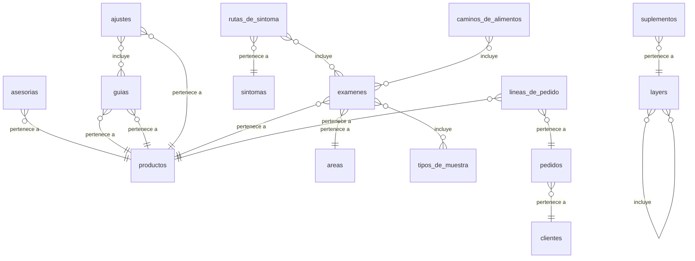

# Modelo de datos de Veronica Wellness

Generado por `npm run vw -- exportar docs` desde `src/modelo/` (versión 1). No se edita a mano: se cambia el modelo y se vuelve a generar.

El modelo es canónico y no depende de ninguna plataforma. Hoy Webflow es su primer adaptador
(CMS y Ecommerce); `docs/modelo.sql` es el mismo modelo en Postgres para un stack propio. Cómo se
conectan las piezas: `docs/INTEGRACION.md`.

## Relaciones

## Entidades

| Entidad | Registros | Dónde vive | Para qué |
|---|---|---|---|
| Productos | 47 | Webflow Ecommerce (producto + SKU) | Lo que se vende: el nombre, el precio y cómo se cobra. Cada asesoría, guía, examen, oferta y cargo es un producto; su presentación vive en su propia colección. |
| Asesorías | 3 | Webflow CMS | Las consultas y ciclos 1:1: lo que incluye cada uno y lo que pasa después de pagar. |
| Guías | 4 | Webflow CMS | Las guías y recetarios en PDF de la tienda. |
| Ajustes | 1 | Webflow CMS | Valores de funcionamiento del sitio. Hay un solo registro. |
| Áreas de exámenes | 11 | Webflow CMS | Los grupos del catálogo de exámenes (Gastrointestinal, Hormonales…). |
| Tipos de muestra | 7 | Webflow CMS | Cómo se toma la muestra de un examen (heces, sangre, saliva…). |
| Exámenes | 38 | Webflow CMS | Cada tarjeta del catálogo de exámenes con su ficha completa. Un mismo producto puede tener dos tarjetas en áreas distintas. |
| Síntomas | 15 | Webflow CMS | Las tarjetas «por síntoma» que llevan a los exámenes. |
| Rutas de síntoma | 45 | Webflow CMS | Cada pregunta dentro de un síntoma, con los exámenes que propone en orden. |
| Caminos de alimentos | 4 | Webflow CMS | Las preguntas guiadas para elegir un panel de reacciones a alimentos. |
| Testimonios | 9 | Webflow CMS | Las voces de pacientes, con su foto cuando la hay. |
| Preguntas frecuentes | 20 | Webflow CMS | Preguntas del inicio y de exámenes. Los nombres y precios se escriben como {nombre:id} y {precio:id} y se completan solos. |
| Layers | 5 | Webflow CMS | Las cinco capas de The Layer Method™. |
| Suplementos | 17 | Webflow CMS | Los suplementos recomendados en el estante de cada capa. |
| Clientes | — | Pedidos de Webflow (solo modelada; datos personales fuera del repo) | Quien compra. Datos personales: nunca en el repositorio ni en reportes. |
| Pedidos | — | Pedidos de Webflow (solo modelada; datos personales fuera del repo) | Cada compra, con sus montos en centavos. |
| Líneas de pedido | — | Pedidos de Webflow (solo modelada; datos personales fuera del repo) | Cada producto dentro de un pedido. |

### Productos

Lo que se vende: el nombre, el precio y cómo se cobra. Cada asesoría, guía, examen, oferta y cargo es un producto; su presentación vive en su propia colección. Colección `productos`.

| Campo | Slug en Webflow | Tipo | Obligatorio | Ayuda |
|---|---|---|---|---|
| Id | `slug` | texto (slug) | sí | Identificador estable; no cambia nunca. |
| Nombre | `name` | texto | sí | Nombre visible. |
| Tipo | `tipo` | opción: `asesoria`, `guia`, `examen`, `oferta`, `cargo` | sí | Qué clase de producto es; define su categoría. |
| Precio | `precio` | dinero (centavos de USD) | sí | Precio de venta antes de impuestos, en centavos de USD. |
| Impuesto | `impuesto` | opción: `service-professional`, `digital-goods`, `standard-exempt`, `standard-taxable` | sí | Clase de impuesto para el cálculo automático. |
| Enviable | `enviable` | booleano | no | Si el pedido necesita dirección de envío. |
| Sku | `sku` | texto | sí | Código interno único del producto. |
| Descripción | `descripcion` | texto | no | Descripción comercial. |
| Descarga | `descarga` | enlace | no | Enlace que recibe quien compra (PDF de la guía o página de agenda). |

### Asesorías

Las consultas y ciclos 1:1: lo que incluye cada uno y lo que pasa después de pagar. Colección `asesorias`, ordenada por `orden`.

| Campo | Slug en Webflow | Tipo | Obligatorio | Ayuda |
|---|---|---|---|---|
| Id | `slug` | texto (slug) | sí | Identificador estable; no cambia nunca. |
| Nombre | `name` | texto | sí | Nombre visible. |
| Clave | `clave` | texto | sí | Identificador fijo que usa el código (LAYER_SESSION…). |
| Producto | `producto` | → Producto | sí | Producto que se cobra. |
| Consultas | `consultas` | texto | sí | «1 consulta», «2 consultas»… |
| Etiqueta | `etiqueta` | texto | sí | Etiqueta de la tarjeta de precio. |
| Etiqueta nota | `etiqueta-nota` | texto | no | Nota pequeña bajo la etiqueta. |
| Descripción | `descripcion` | texto | sí | Descripción de la tarjeta de precio. |
| Descripción corta | `descripcion-corta` | texto | sí | Descripción del resumen del pago. |
| Incluye | `incluye` | lista (una línea por elemento) | no | Lo que incluye, una línea por punto. |
| Incluye checkout | `incluye-checkout` | lista (una línea por elemento) | no | Lo que incluye en el resumen del pago, una línea por punto. |
| Nota pie | `nota-pie` | texto | no | Nota al pie de la tarjeta. |
| Bonus | `bonus` | texto | no | Regalo que acompaña al ciclo. |
| Confirmación título | `confirmacion-titulo` | texto | sí | Título de la pantalla después de pagar. |
| Confirmación texto | `confirmacion-texto` | texto | sí | Texto de la pantalla después de pagar. |
| Calendly url | `calendly-url` | enlace | sí | Enlace de Calendly para agendar. |
| Calendly etiqueta | `calendly-etiqueta` | texto | sí | Rótulo del enlace de Calendly. |
| Pública | `publica` | booleano | no | Si se muestra con precio en el sitio. |
| Orden | `orden` | entero | sí | Posición en el sitio, de menor a mayor. |

### Guías

Las guías y recetarios en PDF de la tienda. Colección `guias`, ordenada por `orden`.

| Campo | Slug en Webflow | Tipo | Obligatorio | Ayuda |
|---|---|---|---|---|
| Id | `slug` | texto (slug) | sí | Identificador estable; no cambia nunca. |
| Nombre | `name` | texto | sí | Nombre visible. |
| Producto | `producto` | → Producto | sí | Producto que se cobra. |
| Oferta | `oferta` | → Producto | no | Producto con el descuento que se ofrece dentro del pedido. |
| Número | `num` | texto | sí | Número del capítulo en la tienda («01»). |
| Páginas | `paginas` | entero | sí | Páginas del PDF. |
| Título portada | `titulo-portada` | texto | sí | Título impreso en la portada. |
| Portada | `portada` | imagen en src/assets/tienda/ | sí | Imagen de la portada. |
| Más vendido | `mas-vendido` | booleano | no | Marca «Más vendido». |
| Subtítulo | `subtitulo` | texto | sí | Subtítulo bajo el nombre. |
| Gancho | `gancho` | texto | sí | Pregunta o frase de entrada. |
| Para ti | `para-ti` | lista (una línea por elemento) | no | «Para ti si…», una línea por punto. |
| Incluye | `incluye` | lista (una línea por elemento) | no | «Dentro encontrarás», una línea por punto. |
| Cita | `cita` | texto | sí | Frase de cierre. |
| Cita página | `cita-pagina` | entero | no | Página del libro de donde sale la cita. |
| Formato | `formato` | texto | sí | «PDF · 34 páginas»… |
| Nota | `nota` | texto | no | Nota de alcance bajo el capítulo. |
| Botón | `boton` | texto | sí | Texto del botón de compra. |
| Tono | `tono` | opción: `clay`, `sage`, `rose` | sí | Color del capítulo. |
| Orden | `orden` | entero | sí | Posición en la tienda, de menor a mayor. |

### Ajustes

Valores de funcionamiento del sitio. Hay un solo registro. Colección `ajustes`; un solo registro.

| Campo | Slug en Webflow | Tipo | Obligatorio | Ayuda |
|---|---|---|---|---|
| Id | `slug` | texto (slug) | sí | Identificador estable; no cambia nunca. |
| Nombre | `name` | texto | sí | Nombre visible. |
| Descuento oferta | `descuento-oferta` | entero | sí | Porcentaje de descuento de la guía ofrecida en el pedido. |
| Oferta guías | `oferta-guias` | ⇉ Guías (ordenadas) | no | Guías que se ofrecen con descuento dentro del pedido, en orden de prioridad. |
| Cargo laboratorio | `cargo-laboratorio` | → Producto | sí | Producto del cargo de laboratorio. |
| Wholescripts registro | `wholescripts-registro` | enlace | sí | Página de registro en Wholescripts. |
| Wholescripts codigo | `wholescripts-codigo` | texto | no | Código de la cuenta en Wholescripts. |
| Wholescripts apellido | `wholescripts-apellido` | texto | no | Apellido para buscar la cuenta. |
| Wholescripts pendiente | `wholescripts-pendiente` | booleano | no | Si la cuenta de Wholescripts está por confirmar. |

### Áreas de exámenes

Los grupos del catálogo de exámenes (Gastrointestinal, Hormonales…). Colección `areas`, ordenada por `orden`.

| Campo | Slug en Webflow | Tipo | Obligatorio | Ayuda |
|---|---|---|---|---|
| Id | `slug` | texto (slug) | sí | Identificador estable; no cambia nunca. |
| Nombre | `name` | texto | sí | Nombre visible. |
| Color | `color` | opción: `clay`, `clay-deep`, `clay-rich`, `rose`, `rose-deep`, `sage`, `sage-deep`, `olive`, `sand`, `charcoal` | sí | Color del grupo. |
| Ícono | `icono` | texto | sí | Trazo SVG del ícono del grupo. |
| Descripción | `descripcion` | texto | sí | Descripción bajo el nombre del grupo. |
| Orden | `orden` | entero | sí | Posición en el catálogo, de menor a mayor. |

### Tipos de muestra

Cómo se toma la muestra de un examen (heces, sangre, saliva…). Colección `tipos-de-muestra`, ordenada por `orden`.

| Campo | Slug en Webflow | Tipo | Obligatorio | Ayuda |
|---|---|---|---|---|
| Id | `slug` | texto (slug) | sí | Identificador estable; no cambia nunca. |
| Nombre | `name` | texto | sí | Nombre visible. |
| Orden | `orden` | entero | sí | Posición, de menor a mayor. |

### Exámenes

Cada tarjeta del catálogo de exámenes con su ficha completa. Un mismo producto puede tener dos tarjetas en áreas distintas. Colección `examenes`, ordenada por `orden`.

| Campo | Slug en Webflow | Tipo | Obligatorio | Ayuda |
|---|---|---|---|---|
| Id | `slug` | texto (slug) | sí | Identificador estable; no cambia nunca. |
| Nombre | `name` | texto | sí | Nombre visible. |
| Producto | `producto` | → Producto | sí | Producto que se cobra (nombre y precio). |
| Área | `area` | → Área | sí | Área del catálogo. |
| Laboratorio | `laboratorio` | opción: `Doctor's Data`, `Alletess`, `US BioTek`, `DUTCH`, `Genova` | no | Laboratorio que lo procesa. |
| Muestras | `muestras` | ⇉ Tipos de muestra (ordenadas) | no | Tipos de muestra que pide. |
| En casa | `en-casa` | booleano | no | Si la muestra se toma en casa. |
| Descripción | `descripcion` | texto | sí | Descripción del examen. |
| Instructivo | `instructivo` | enlace | no | PDF con las instrucciones. |
| Gancho | `gancho` | texto | sí | Frase de entrada de la ficha. |
| Qué mide | `que-mide` | lista (una línea por elemento) | no | Qué mide, una línea por punto. |
| Por qué importa | `por-que-importa` | texto | sí | Por qué importa. |
| Ideal | `ideal` | lista (una línea por elemento) | no | Ideal si…, una línea por punto. |
| Obtienes | `obtienes` | lista (una línea por elemento) | no | Qué obtienes, una línea por punto. |
| Alimentos | `alimentos` | entero | no | Cuántos alimentos evalúa (paneles). |
| Mide | `mide` | lista (una línea por elemento) | no | Qué evalúa el panel de alimentos, una línea por punto. |
| Orden | `orden` | entero | sí | Posición en el catálogo, de menor a mayor. |

### Síntomas

Las tarjetas «por síntoma» que llevan a los exámenes. Colección `sintomas`, ordenada por `orden`.

| Campo | Slug en Webflow | Tipo | Obligatorio | Ayuda |
|---|---|---|---|---|
| Id | `slug` | texto (slug) | sí | Identificador estable; no cambia nunca. |
| Nombre | `name` | texto | sí | Nombre visible. |
| Ejemplos | `ejemplos` | texto | sí | Ejemplos en la voz de la visitante. |
| Color | `color` | opción: `clay`, `clay-deep`, `clay-rich`, `rose`, `rose-deep`, `sage`, `sage-deep`, `olive`, `sand`, `charcoal` | sí | Color de la tarjeta. |
| Ícono | `icono` | texto | sí | Trazo SVG del ícono. |
| Orientación | `orientacion` | booleano | no | Si propone empezar por una consulta. |
| Orden | `orden` | entero | sí | Posición, de menor a mayor. |

### Rutas de síntoma

Cada pregunta dentro de un síntoma, con los exámenes que propone en orden. Colección `rutas-de-sintoma`, ordenada por `orden`.

| Campo | Slug en Webflow | Tipo | Obligatorio | Ayuda |
|---|---|---|---|---|
| Id | `slug` | texto (slug) | sí | Identificador estable; no cambia nunca. |
| Nombre | `name` | texto | sí | Nombre visible. |
| Síntoma | `sintoma` | → Síntoma | sí | Síntoma al que pertenece. |
| Pregunta | `pregunta` | texto | sí | Pregunta que abre la ruta. |
| Exámenes | `examenes` | ⇉ Exámenes (ordenadas) | no | Exámenes que propone, del más simple al más completo. |
| Orden | `orden` | entero | sí | Posición dentro del síntoma, de menor a mayor. |

### Caminos de alimentos

Las preguntas guiadas para elegir un panel de reacciones a alimentos. Colección `caminos-de-alimentos`, ordenada por `orden`.

| Campo | Slug en Webflow | Tipo | Obligatorio | Ayuda |
|---|---|---|---|---|
| Id | `slug` | texto (slug) | sí | Identificador estable; no cambia nunca. |
| Nombre | `name` | texto | sí | Nombre visible. |
| Pregunta | `pregunta` | texto | sí | Pregunta del camino. |
| Ayuda | `ayuda` | texto | sí | Texto de ayuda bajo la pregunta. |
| Exámenes | `examenes` | ⇉ Exámenes (ordenadas) | no | Exámenes que propone. |
| Orden | `orden` | entero | sí | Posición, de menor a mayor. |

### Testimonios

Las voces de pacientes, con su foto cuando la hay. Colección `testimonios`, ordenada por `prioridad`.

| Campo | Slug en Webflow | Tipo | Obligatorio | Ayuda |
|---|---|---|---|---|
| Id | `slug` | texto (slug) | sí | Identificador estable; no cambia nunca. |
| Nombre | `name` | texto | sí | Nombre visible. |
| Lugar | `lugar` | texto | no | País o ciudad. |
| Foto | `foto` | imagen en src/assets/testimonios/ | no | Foto pequeña y nítida. |
| Motivos | `motivos` | lista (una línea por elemento) | no | Motivos de consulta, una línea por motivo. |
| Destacado | `destacado` | texto | sí | La frase que se destaca. |
| Texto | `texto` | párrafos (línea vacía entre párrafos) | no | El testimonio completo; una línea vacía separa los párrafos. |
| Prioridad | `prioridad` | entero | sí | Orden en el muro, de menor a mayor. |
| En asesorías | `en-asesorias` | booleano | no | Si aparece también en la página de Asesorías. |

### Preguntas frecuentes

Preguntas del inicio y de exámenes. Los nombres y precios se escriben como {nombre:id} y {precio:id} y se completan solos. Colección `preguntas-frecuentes`, ordenada por `orden`.

| Campo | Slug en Webflow | Tipo | Obligatorio | Ayuda |
|---|---|---|---|---|
| Id | `slug` | texto (slug) | sí | Identificador estable; no cambia nunca. |
| Nombre | `name` | texto | sí | Nombre visible. |
| Página | `pagina` | opción: `inicio`, `examenes` | sí | Página donde aparece. |
| Pregunta | `pregunta` | texto | sí | La pregunta. |
| Respuesta | `respuesta` | texto | sí | La respuesta. |
| Orden | `orden` | entero | sí | Posición en su página, de menor a mayor. |

### Layers

Las cinco capas de The Layer Method™. Colección `layers`, ordenada por `orden`.

| Campo | Slug en Webflow | Tipo | Obligatorio | Ayuda |
|---|---|---|---|---|
| Id | `slug` | texto (slug) | sí | Identificador estable; no cambia nunca. |
| Nombre | `name` | texto | sí | Nombre visible. |
| Pregunta | `pregunta` | texto | sí | La pregunta de la capa. |
| Observa texto | `observa-texto` | texto | sí | Introducción a lo que observa. |
| Observa | `observa` | lista (una línea por elemento) | no | Lo que observa, una línea por punto. |
| Cita | `cita` | texto | sí | Cita de la capa. |
| Conecta | `conecta` | ⇉ Layers (ordenadas) | no | Capas con las que se conecta. |
| Rol | `rol` | texto | sí | Rol de la capa. |
| Color | `color` | opción: `clay`, `clay-deep`, `clay-rich`, `rose`, `rose-deep`, `sage`, `sage-deep`, `olive`, `sand`, `charcoal` | sí | Color de la capa. |
| Oscuro | `oscuro` | booleano | no | Si la capa va sobre fondo oscuro. |
| Orden | `orden` | entero | sí | Posición, de menor a mayor. |

### Suplementos

Los suplementos recomendados en el estante de cada capa. Colección `suplementos`, ordenada por `orden`.

| Campo | Slug en Webflow | Tipo | Obligatorio | Ayuda |
|---|---|---|---|---|
| Id | `slug` | texto (slug) | sí | Identificador estable; no cambia nunca. |
| Nombre | `name` | texto | sí | Nombre visible. |
| Marca | `marca` | texto | sí | Marca del suplemento. |
| Layer | `layer` | → Layer | sí | Capa en cuyo estante aparece. |
| Orden | `orden` | entero | sí | Posición dentro de su capa, de menor a mayor. |

### Clientes

Quien compra. Datos personales: nunca en el repositorio ni en reportes. Colección `clientes`.

| Campo | Slug en Webflow | Tipo | Obligatorio | Ayuda |
|---|---|---|---|---|
| Id | `slug` | texto (slug) | sí | Identificador estable; no cambia nunca. |
| Nombre | `name` | texto | sí | Nombre visible. |
| Email | `email` | texto | sí | Correo, en minúsculas; identifica a la clienta. |
| Apellido | `apellido` | texto | sí | Apellido. |
| Teléfono | `telefono` | texto | no | Teléfono con código de país. |
| País | `pais` | texto | no | País. |
| Fuente | `fuente` | texto | no | Cómo conoció a Verónica. |

### Pedidos

Cada compra, con sus montos en centavos. Colección `pedidos`.

| Campo | Slug en Webflow | Tipo | Obligatorio | Ayuda |
|---|---|---|---|---|
| Id | `slug` | texto (slug) | sí | Identificador estable; no cambia nunca. |
| Nombre | `name` | texto | sí | Nombre visible. |
| Cliente | `cliente` | → Cliente | sí | Quien compra. |
| Fecha | `fecha` | fecha | sí | Momento de la compra. |
| Estado | `estado` | opción: `iniciado`, `pendiente`, `pagado`, `cumplido`, `reembolsado` | sí | Estado del pedido. |
| Método pago | `metodo-pago` | opción: `tarjeta`, `apple-pay`, `google-pay`, `paypal`, `zelle` | sí | Cómo se pagó. |
| Moneda | `moneda` | opción: `USD` | sí | Moneda. |
| Subtotal | `subtotal` | dinero (centavos de USD) | sí | Suma de las líneas. |
| Impuesto | `impuesto` | dinero (centavos de USD) | sí | Impuesto cobrado. |
| Envío | `envio` | dinero (centavos de USD) | sí | Envío cobrado. |
| Total | `total` | dinero (centavos de USD) | sí | Total cobrado. |

### Líneas de pedido

Cada producto dentro de un pedido. Colección `lineas-de-pedido`.

| Campo | Slug en Webflow | Tipo | Obligatorio | Ayuda |
|---|---|---|---|---|
| Id | `slug` | texto (slug) | sí | Identificador estable; no cambia nunca. |
| Nombre | `name` | texto | sí | Nombre visible. |
| Pedido | `pedido` | → Pedido | sí | Pedido al que pertenece. |
| Producto | `producto` | → Producto | sí | Producto comprado. |
| Cantidad | `cantidad` | entero | sí | Unidades. |
| Precio unitario | `precio-unitario` | dinero (centavos de USD) | sí | Precio por unidad al momento de la compra. |
